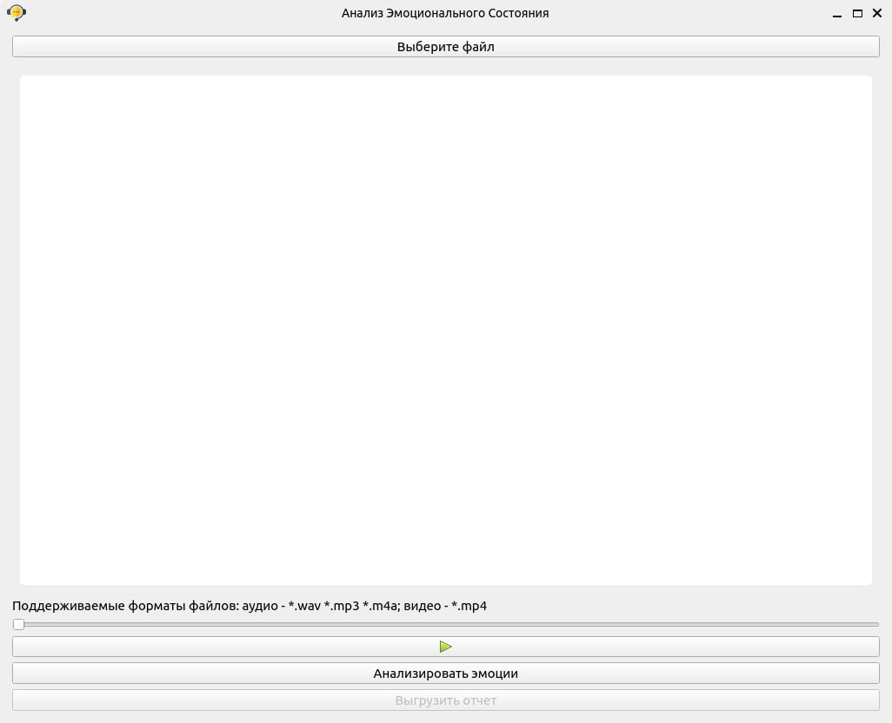
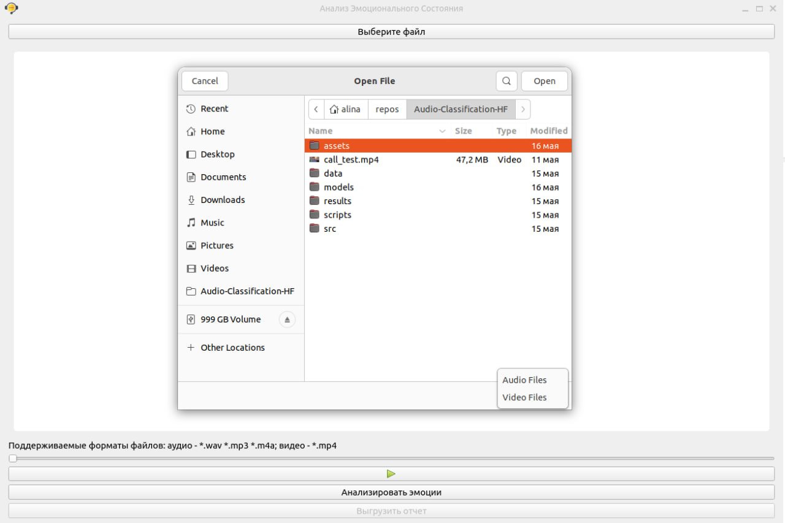
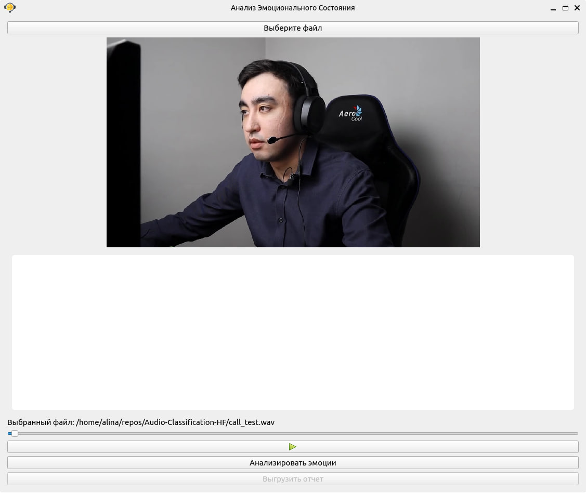
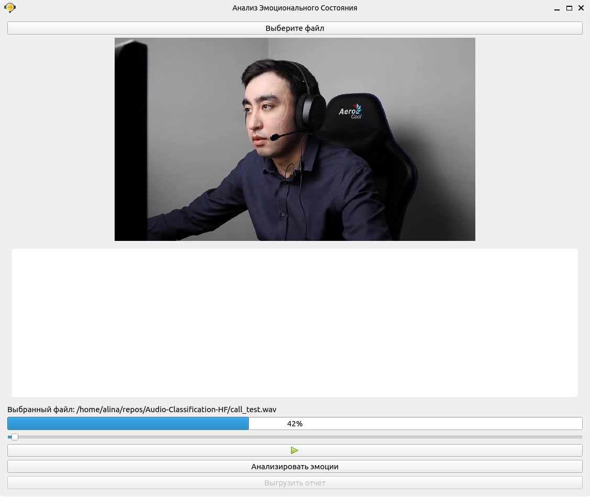

# AUDIO-CLASSIFICATION-HF
## Introduction
Emotion recognition is a powerful tool that can be used in a variety of applications, such as improving customer service, personalizing user experiences, and helping people with speech disorders communicate more effectively.

This project aimes to develop a solution that can accurately detect and analyze the emotional state of call center employees during customer interactions, leveraging the power of transformer models such as Wav2Vec2.0, HuBERT and WavLM.

## Datasets
The are two datasets that are used for this project: 
- [Dusha](https://github.com/salute-developers/golos/tree/master/dusha#dusha-dataset) is a bi-modal corpus suitable for speech emotion recognition (SER) tasks. The dataset consists of about 300 000 audio recordings with Russian speech, their transcripts and emotiomal labels. The corpus contains approximately 350 hours of data. Four basic emotions that usually appear in a dialog with a virtual assistant were selected: Happiness (Positive), Sadness, Anger and Neutral emotion.

**NB**: In this project only small subset of Dusha dataset was used.

- [EmoCall](https://drive.google.com/drive/folders/1WJO-pPKU9b0sMmeVkECdOYpHz1EzNZGC?usp=drive_link) is a data set of 329 telephone recordings with Russian speech from 10 actors. Actors spoke from a selection of 10 sentences for each emotion. The sentences were presented using one of six different emotions (Anger, Positive, Neutral, Sad and Other).

The files contain speech that is sampled at 16 kHz and saved as 16-bit PCM WAV files.

## Models
### Pre-trained speech model based on transformer architecture

| Models     | Pretrained Checkpoints |
|-------- | ------- |
| Wav2Vec2.0 | [facebook/hubert-large-ls960-ft](https://huggingface.co/facebook/hubert-large-ls960-ft)    |
| HuBERT     |[jonatasgrosman/wav2vec2-large-xlsr-53-russian](https://huggingface.co/jonatasgrosman/wav2vec2-large-xlsr-53-russian) |
| WavLM      | [microsoft/wavlm-large](https://huggingface.co/microsoft/wavlm-large)  |

### Speech models after training on Dusha dataset
All checkpoints can be found [here](https://drive.google.com/drive/folders/1VASoT9HM0NOveSSgJ9AmKGInryiR6zYe?usp=sharing)

| Models   (Group_1) |Path to Checkpoints in the folder above|
|-------- | ------- |
| Wav2Vec2.0 |  `dusha/wav2vec2/audio-model`|
| HuBERT     |`dusha/hubert/audio-model`|
| WavLM      |  `dusha/wavlm/audio-model` |

### Speech models after training on Dusha and EmoCall datasets
| Models   (Group_2)  | Path to Checkpoints in the folder abov |
|-------- | ------- |
| Wav2Vec2.0 |  `emocall/wav2vec/audio-model`|
| HuBERT     |`emocall/hubert/audio-model`|
| WavLM      |  `emocall/wavlm/audio-model` | 

## Training 
In the `scripts` folder you can fined training and evaluation scripts for Wav2Vec2.0, HuBERT, WavLM on Dusha and EmoCall Datasets.

## Results
| Models     | Accuracy on EmoCall (Group_1)| Accuracy on EmoCall (Group_2)|
|------------|:------------------------------:|:------------------------------:|
| Wav2Vec2.0 |  0.88    |  0.98     |  
| HuBERT     |   0.73   |    0.98   |
| WavLM      |   0.93   |    0.99   |

According to the results of evaluation on EmoCall dataset, it was decided to use WavLM model (Group_2) for the prototype application as it demonstrates its ability to accurately recognize emotions in speech 99% accuracy.

## Requirements
To install the necessary dependencies, run the following command:
Clone the repository:
```
git clone https://github.com/AlinaShapiro/Audio-Classification-HF.git
```
Install the requirements
```
pip install -r requirements.txt
```
## Usage 
To run the app, run the following command:

```python
python app.py
```
## Screenshots of App

Main Window 



Select a video(.mp4) or audio(.wav, .mp3) file to analyze by clicking on "Выбрать файл" button.


Click on the playback button to play the selected video or audio file.


Click on a "Анализировать эмоции" button to analyze a file for the presence of certain emotions (anger, positive, neutral, sad, and other) using the WavLM model.


After the analysis process is completed, you will see a graphical representation of your emotional state.


## Conclusion
Emotion recognition in speech is a challenging but important task that has many practical applications. By using application that accuratly identifies emotional state of call-center employees call-center athorities may use that to enhance  employees' emotional well-being, productivity level.
